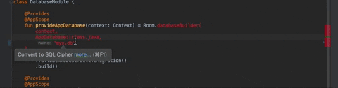

# Android SecuRefactor 

Intellij plugin for secure Android refactoring


## Migrating to EncryptedSharedPreferences and EncryptedFile

First, import the library 

```
implementation "androidx.security:security-crypto:1.0.0-alpha02"

```

### Converting to encrypted shared preferences


Or search automatically for shared preferences


### Converting to encrypted file


## Obfuscating strings

First you'll need to import the obfuscation library 

```
repositories {
    maven {
        url "https://dl.bintray.com/dllewellyn/kotlin-string-obfuscator"
    }
}

dependencies {
    implementation 'com.secure.obfuscated:kotlin-string-obfuscator:1.0.0' // Check latest version first! 
}
```


## Migrate to SQL Cipher

Import the library 


```
implementation 'net.zetetic:android-database-sqlcipher:4.3.0@aar'
implementation "androidx.sqlite:sqlite:2.0.1"
```


